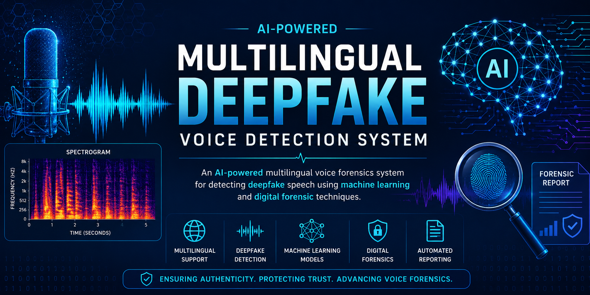
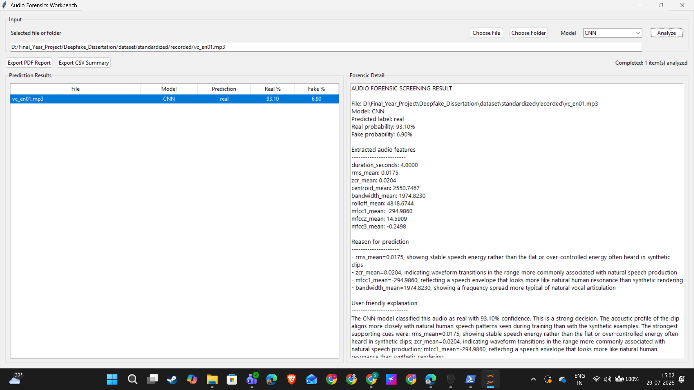
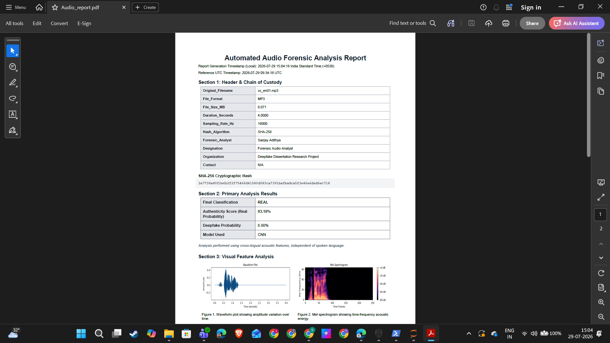

# Multilingual Deepfake Voice Detection

<p align="center">
  
</p>

<p align="center">
  <strong>An AI-Powered Digital Forensics System for Detecting AI-Generated Speech Across Multiple Languages</strong>
</p>

<p align="center">


</p>

---

# Table of Contents

- [Overview](#overview)
- [Why This Project?](#why-this-project)
- [Key Features](#key-features)
- [Screenshots](#screenshots)
- [Workflow](#workflow)
- [Installation](#installation)
- [Project Structure](#project-structure)
- [Machine Learning Models](#machine-learning-models)
- [Performance Summary](#performance-summary)
- [Evaluation](#evaluation)
- [Technologies Used](#technologies-used)
- [Applications](#applications)
- [Future Enhancements](#future-enhancements)
- [License](#license)
- [Author](#author)
- [Acknowledgements](#acknowledgements)

---

# Overview

Artificial Intelligence has significantly advanced speech synthesis technologies, enabling highly realistic synthetic voice generation. While these technologies have numerous legitimate applications, they also introduce challenges related to misinformation, impersonation, digital fraud, and cybercrime.

This project presents an AI-powered multilingual voice forensics application capable of identifying AI-generated speech using deep learning and traditional machine learning techniques. The system combines audio feature extraction, automated classification, confidence estimation, and forensic report generation into a single desktop application suitable for digital forensic investigations and academic research.

---

# Why This Project?

Deepfake speech has become increasingly convincing, making manual identification difficult even for experienced investigators.

This project was developed to provide an automated forensic workflow capable of:

- Detecting synthetic speech
- Supporting multilingual audio analysis
- Generating structured forensic reports
- Assisting digital forensic investigations
- Providing an intuitive desktop interface for researchers and analysts

---

# Key Features

- Multilingual Deepfake Voice Detection
- CNN-based Deep Learning Classifier
- Random Forest Baseline Model
- Log-Mel Spectrogram Feature Extraction
- MFCC Feature Extraction
- Interactive Desktop GUI
- Confidence Score Estimation
- Automated PDF Forensic Report Generation
- Comprehensive Evaluation Metrics
- ROC Curve Analysis
- Confusion Matrix Generation
- Statistical Performance Analysis
- Designed for Digital Forensics and Cybersecurity Applications

---

# Screenshots

## Application Home

<p align="center">

</p>

---

## Audio Analysis

<p align="center">

</p>

---

## Automated Forensic Report

<p align="center">

</p>

---

# Workflow

```
Audio Recording
        │
        ▼
Audio Preprocessing
        │
        ▼
Feature Extraction
(Log-Mel Spectrogram / MFCC)
        │
        ▼
Model Selection
 ├── CNN
 └── Random Forest
        │
        ▼
Prediction
        │
        ▼
Confidence Score
        │
        ▼
Forensic Report Generation
```

---

# Installation

Clone the repository.

```bash
git clone https://github.com/sanjayadithyaa/Multilingual-Deepfake-Voice-Detection.git
```

Move into the project.

```bash
cd Multilingual-Deepfake-Voice-Detection
```

Install dependencies.

```bash
pip install -r requirements.txt
```

Launch the application.

```bash
python run_forensics_app.py
```

---

# Project Structure

```
Multilingual-Deepfake-Voice-Detection
│
├── app/                  Application source code
├── assets/               Banner and documentation images
├── dataset/              Audio datasets
├── docs/                 Documentation
├── models/               Trained ML models
├── notebooks/            Research notebooks
├── reports/              Generated forensic reports
├── results/              Model evaluation results
├── screenshots/          GUI screenshots
├── scripts/              Utility scripts
│
├── requirements.txt
├── run_forensics_app.py
├── LICENSE
└── README.md
```

---

# Machine Learning Models

## Convolutional Neural Network (CNN)

The CNN model utilises Log-Mel Spectrogram representations to learn discriminative patterns between genuine and AI-generated speech.

**Purpose**

- Primary deep learning classifier
- High classification accuracy
- Production-ready inference

---

## Random Forest

The Random Forest model serves as a classical machine learning baseline using MFCC features extracted from the audio recordings.

**Purpose**

- Baseline comparison
- Fast inference
- Performance benchmarking

---

# Performance Summary

| Model | Accuracy | AUC Score | Purpose |
|--------|----------|-----------|---------|
| CNN | 99.2% | 0.9972 | Primary Deep Learning Model |
| Random Forest | 97.6% | 0.9906 | Baseline Machine Learning Model |

**Evaluation Dataset**

- Approximately 3,000 test audio samples

---

# Evaluation

The project includes comprehensive evaluation using:

- Classification Reports
- Confusion Matrices
- ROC Curves
- Prediction Confidence Scores
- Language-wise Performance Analysis
- Statistical Hypothesis Testing
- Comparative Model Evaluation

Generated evaluation outputs are stored inside the **results/** directory.

---

# Technologies Used

- Python
- TensorFlow / Keras
- Scikit-learn
- NumPy
- Pandas
- Librosa
- Matplotlib
- ReportLab
- Tkinter

---

# Applications

This project is applicable to:

- Digital Forensics
- Cybercrime Investigation
- Multimedia Authentication
- Voice Authentication
- AI-generated Media Detection
- Cybersecurity Research
- Academic Research
- Law Enforcement Support

---

# Future Enhancements

- Real-time Streaming Audio Analysis
- Transformer-based Speech Models
- Explainable AI (XAI)
- Mobile Application
- REST API Deployment
- Cloud Deployment
- Additional Language Support
- Speaker Verification Integration

---

# License

This project is distributed under the MIT License.

See the **LICENSE** file for further details.

---

# Author

**S Sanjay Adithyaa**

M.Sc. Forensic Science  
Specialization: Digital Forensics & Cybersecurity

**GitHub:** [@sanjayadithyaa](https://github.com/sanjayadithyaa)

---

# Acknowledgements

This project was developed as part of postgraduate research in Digital Forensics and Artificial Intelligence, focusing on multilingual deepfake voice detection.

The project also benefits from the open-source machine learning and audio processing ecosystem, including TensorFlow, Scikit-learn, Librosa, NumPy, Pandas, and ReportLab. 